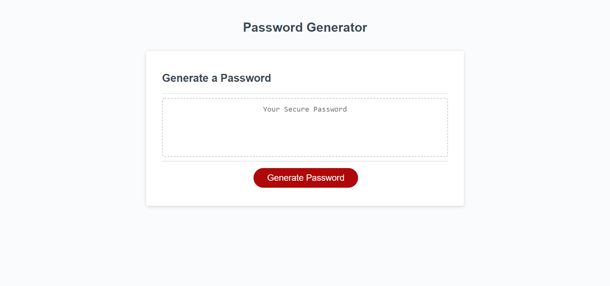
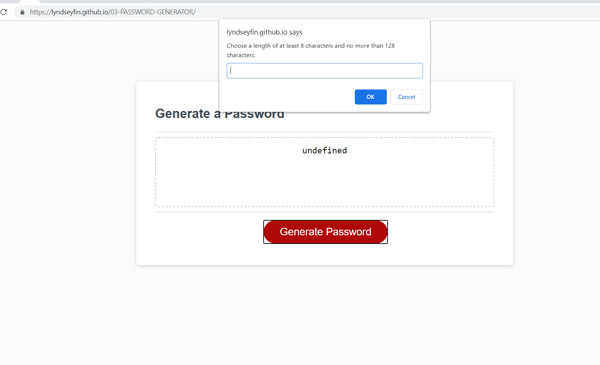

# 03-PASSWORD-GENERATOR
Third homework assignment

## Javascript
- I edited and added to the JS to create a randomized password generator between 8 and 128 characters
- User will be prompted by computer to answer 5 questions pertaining to your generated password
- If user does not meet requirements computer will return 'Invalid' and/or 'Undefined'
- If user does meet password criteria, then the computer will generate users desired password length/content

### Link to deployed application 
<a href= "https://lyndseyfin.github.io/03-PASSWORD-GENERATOR/">Password Generator</a>

#### Screenshot

##### License 

Copyright <YEAR> <COPYRIGHT HOLDER>

Permission is hereby granted, free of charge, to any person obtaining a copy of this software and associated documentation files (the "Software"), to deal in the Software without restriction, including without limitation the rights to use, copy, modify, merge, publish, distribute, sublicense, and/or sell copies of the Software, and to permit persons to whom the Software is furnished to do so, subject to the following conditions:

The above copyright notice and this permission notice shall be included in all copies or substantial portions of the Software.

THE SOFTWARE IS PROVIDED "AS IS", WITHOUT WARRANTY OF ANY KIND, EXPRESS OR IMPLIED, INCLUDING BUT NOT LIMITED TO THE WARRANTIES OF MERCHANTABILITY, FITNESS FOR A PARTICULAR PURPOSE AND NONINFRINGEMENT. IN NO EVENT SHALL THE AUTHORS OR COPYRIGHT HOLDERS BE LIABLE FOR ANY CLAIM, DAMAGES OR OTHER LIABILITY, WHETHER IN AN ACTION OF CONTRACT, TORT OR OTHERWISE, ARISING FROM, OUT OF OR IN CONNECTION WITH THE SOFTWARE OR THE USE OR OTHER DEALINGS IN THE SOFTWARE.
